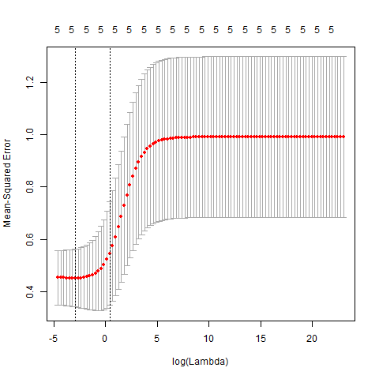
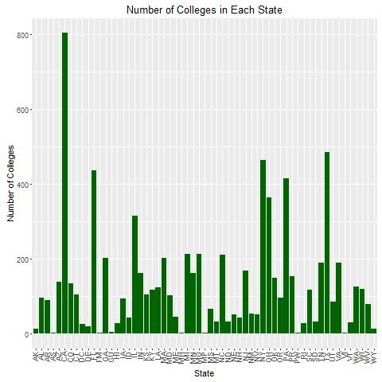

```{r setup, include = FALSE}
knitr::opts_chunk$set(echo = FALSE)
library(xtable)

load('../data/multiple-linear-reg.RData')
load("../data/rigde-reg.RData")
load("../data/rigde1-reg.RData")
load("../data/rigde2-reg.RData")
load("../data/random-forest-low.RData")
load("../data/random-forest-mid.RData")
load("../data/random-forest-top.RData")
load("../data/PCIP.RData")
```

##Purpose
Providing our client from the biotech industry with the most qualified schools that fulfill their criterias of recruitment. 

##How: 
1. Determine the best schools for our client, we need to set a bar on what determines a "top school".
2. Use College ScoreCard dataset. 
3. Set our dependent variable to be **earnings** after graduation. 
4. We will then look at how our other independent variables influence the earnings.

##Selecting predictors. 
    - Average SAT math and ACT scores
    - Schools admission rate. 
    - Graduation rate.
    - Pell Grant recipent 
    - Percentage of students who received a 4 year degree in STEM fields.

##Data cleaning. 
    - Removing rows containing empty entries 
    - Remove rows with any values
    - Remove rows with privacy supressed 
    - Turn the structure of the columns from factors to numerics. 

##3 tiers of earning
* top tier > $75k
* middle tier = $30k - 75k
* low tier < $30k

## Random Forest variance importance 
```{r}
varplot
```
#### find best features to predict the future earnings

##Multiple linear regression


##Multiple linear regression coefficients, MSE and R-square
####Coefficients 
```{r}
TopCoef
```
####MSE 
```{r}
TopMSE
```
####R-square
```{r}
R_squared_summary <- c(TopLMsum, MidLMsum, LowLMsum)
R_squared_summary <- as.data.frame(R_squared_summary)
rownames(R_squared_summary) <- c('Top Tier', 'Middle Tier', 'Low Tier')
R_squared_summary
```

##Ridge regression



##Ridge regression coefficients
#### coefficients
```{r}
coeff_ridge
```

- Produces similar R squares and MSE for all tiers.  
- Adds a penalty term to reduce overfitting, which produces better results than MPR. 
- The results can best be explained through our coefficients.  

##Ridge MSE
```{r}
full_mse_ridge
```


##Observations: 
- (+) relationship between future earnings and SAT math, ACT scores and graduation rate. 
- (-) relationship between future earnings with admission rate and pell grant recipients. 
  - the less schools they admit, the higher the earnings are. 
- **Pell-grants** come from a more disadvantaged family, lack of resources.  People who don’t receive pell grants have more resources in support, which relates to higher earnings in the future.

## California has the most top schools

```{r, out.width = "400px"}

```

#### California has most of the largest top STEM programs, vaguely followed by Texas and New York.  

##Biology schools 
```{r, out.width = "500px"}

```

##Biology schools
```{r}
bio
```
